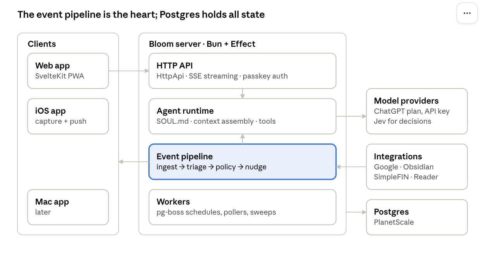

## Architecture overview

One long-running Bun server owns everything: the API, the agent runtime, the event pipeline, and background workers. Clients are thin. Postgres is the only state.



Clients talk only to the API. Integrations feed events into the pipeline, which uses the agent runtime to write nudges and pushes them back to clients. Workers run the schedules and pollers that keep events flowing.

## Tech stack

The stack is TypeScript end to end on the server, Svelte on the web, and Swift on Apple devices, with Postgres as the single source of truth.

| Layer          | Choice                                                                      | Why                                                                                            |
| -------------- | --------------------------------------------------------------------------- | ---------------------------------------------------------------------------------------------- |
| Runtime        | Bun **(decided)**                                                           | Comfort zone, fast, good for agent tooling                                                     |
| Core framework | Effect **(decided, pending a spike)**                                       | Typed errors, retry schedules, Layers for swappable models and sources, built-in OpenTelemetry |
| HTTP / RPC     | `@effect/platform` HttpApi                                                  | One typed API definition generates server handlers, a TS client, and an OpenAPI spec for Swift |
| Database       | Postgres on PlanetScale                                                     | Already paid for; good UI. Drizzle or Effect SQL for queries                                   |
| Job queue      | pg-boss (Postgres-backed)                                                   | No Redis. Schedules, retries, and singleton jobs for nudges and ingestion                      |
| Web client     | SvelteKit (Svelte 5 runes)                                                  | Fun is allowed. Wire in Svelte's LLM docs and MCP server to keep agents on runes syntax        |
| Apple clients  | SwiftUI **(decided)**                                                       | Required for HealthKit, share sheet, Lock Screen capture, App Intents, widgets                 |
| Auth           | Better Auth with passkeys                                                   | Single user; also issues tokens for the iOS app later                                          |
| Inference      | Provider-agnostic model layer                                               | Sign in with ChatGPT for conversation; API key fallback; Jev for triage decisions              |
| Observability  | OpenTelemetry → Langfuse (self-hosted) + a trace backend                    | Replay exactly why Bloom said or did something                                                 |
| Hosting        | Backend on the home Linux server via Tailscale; Railway as the cloud option | Long-running workers don't fit Vercel or Workers                                               |

**Effect spike before committing.** Spend one session building the model-provider Layer and one pg-boss job in Effect. If it feels like fighting the framework, fall back to plain TS with `neverthrow` and keep the same module boundaries.

## Repo structure

Use a Bun workspaces monorepo. The domain and API contract live in shared packages, so the server, web, and (later) a generated Swift client never drift.

```
bloom/
  apps/
    server/          # Bun + Effect: HTTP API, agent runtime, workers
    web/             # SvelteKit PWA
    ios/             # Xcode project (Phase 3+), not part of Bun workspaces
  packages/
    domain/          # Effect Schema: entities, events, IDs, shared types
    api/             # HttpApi definition (single source of truth for the contract)
    db/              # schema, migrations, repositories
    agent/           # model layer, tools, prompt assembly, soul doc loader
    integrations/    # one module per source: google, obsidian, healthkit, simplefin, reader, linear
    pipeline/        # event ingestion, triage, interruption policy, nudge delivery
  docs/
    VISION.md
    ARCHITECTURE.md
    SOUL.md          # Bloom's persona; loaded at runtime, versioned in git
    decisions/       # ADRs, one file per decision
  CLAUDE.md
```

Rules: `apps/*` depend on `packages/*`, never the reverse. `integrations/*` never import from `agent/`; they produce events and expose tools through interfaces defined in `domain/`.

## Core data model

The agent operates over structured domain objects, not chat transcripts. Chat is one input among many. Get this layer right first; everything else hangs off it.

| Entity    | What it is                                         | Key fields                                                                                                           |
| --------- | -------------------------------------------------- | -------------------------------------------------------------------------------------------------------------------- |
| `Task`    | A thing to do once                                 | title, notes, status, due, scheduled\_for, effort (spoons), energy\_kind, area, source, parent\_id                   |
| `Routine` | A recurring task or self-care habit                | recurrence rule, flexibility window, last\_done, streak policy (forgiving by default)                                |
| `Chore`   | Household routine with a cadence                   | cadence, last\_done, owner, rough effort                                                                             |
| `Area`    | Life domain grouping                               | name (Home, Health, Money, Projects, Self)                                                                           |
| `Capture` | Raw input before triage                            | kind (text, voice, share, image), payload, transcript, status (new, routed, dismissed), routed\_to                   |
| `Item`    | A saved link after triage                          | kind (article, product, recipe, idea), url, title, why\_saved, destination (reader, considering, project), decay\_at |
| `Thread`  | A conversation                                     | kind (main, side, quest), parent\_thread\_id, topic, context\_scope, status                                          |
| `Message` | One turn in a thread                               | role, content parts (text, image, ui\_component), tool calls                                                         |
| `Event`   | Anything that happened that Bloom might care about | source, type, occurred\_at, payload, dedupe\_key                                                                     |
| `Nudge`   | A proactive message Bloom decided to send          | trigger\_event\_id, reasoning, channel, actions, sent\_at, outcome (done, snoozed, dismissed, ignored)               |
| `Memory`  | Durable facts about Gabby                          | statement, source, confidence, sensitivity tier, last\_confirmed                                                     |
| `CheckIn` | Energy and mood snapshot                           | spoons available, note, at                                                                                           |

**Design rules**

- Every agent-visible mutation goes through domain services, never raw SQL from a tool. That's how Bloom gets an audit log for free.
- `Nudge.outcome` is training data for the interruption policy. Record it from day one.
- Sensitivity tiers on `Memory` and sources: `normal`, `private` (finance, health), `restricted` (therapy notes). Tier controls what enters a model context by default.
- Import Spoonful's spoon and energy concepts as fields, not as a separate subsystem.

## Agent runtime and model layer

Own the agent loop. It's short, and a coding harness's assumptions (filesystem, bash, long interactive sessions) are wrong for Bloom. Runs are short and frequent, triggered by schedules and events as often as by Gabby typing.

**Model layer.** Define a `ModelProvider` Effect service with one interface: `generate`, `stream`, and `decide`. Each implementation is a Layer:

- `ChatGptPlanProvider` uses Sign in with ChatGPT for conversational turns. It must handle cap exhaustion by failing over cleanly.
- `ApiKeyProvider` (OpenAI and/or Anthropic) is the fallback, and the default for background runs so they don't silently drain the plan.
- `DecisionProvider` handles typed, high-frequency judgments. Start with a cheap LLM plus structured output; swap in Jev once early access is sorted.

Routing is a static config table keyed by task type (`conversation`, `triage`, `plan`, `summarize`, `side_thread`), not a model.

**Context assembly.** Each run builds its context from:

1. `SOUL.md` (always).
2. A compact "today" snapshot: calendar, due tasks, the latest check-in.
3. Relevant memories filtered by sensitivity tier.
4. Thread history (side threads get a minimal scope by default).
5. Tool definitions for the run type.

Log the assembled context per run, so any reply can be replayed.

**Tools.** Domain tools (create or update task, log a check-in, file a capture) and integration tools (search email, read a calendar day, query notes). Mutating tools on external systems (sending email, launching a coding agent) require a confirmation step surfaced as UI, never auto-executed.

**Generative UI.** Messages can carry typed `ui_component` parts (option picker, task card, confirm or cancel, snooze picker) rendered natively by each client. Define these in `packages/domain` as Effect Schemas so web and Swift share one contract.

**SOUL.md** should cover:

- Voice: warm, calm, plain words, light humor, no exclamation-mark cheerfulness.
- Values: "us vs. the problem," progress over perfection, respect for Gabby's energy on a given day.
- How Bloom disagrees: names the concern once, asks a curious question, offers an alternative, then respects the decision.
- What Bloom never does: guilt, shame, streak-loss drama, fake urgency, or unprompted commentary on sensitive topics.
- Initiative: volunteers ideas and observations, but within the interruption budget.

## Proactivity and nudges

Proactivity is the product, so the event pipeline is a first-class subsystem, not a cron afterthought. Every nudge has to pass an explicit interruption policy.

**Pipeline stages**

1. **Ingest.** Sources write `Event` rows: webhooks (Gmail push, Calendar watch channels), pollers (SimpleFIN, Obsidian vault diff), client uploads (HealthKit, captures), and internal timers (routine due, decay sweep). `dedupe_key` makes ingestion idempotent.
2. **Triage.** The decision model classifies each event: ignore, record silently, or candidate for a nudge. This is cheap and high-volume, which is why Jev fits here.
3. **Policy.** Candidates go through the interruption policy (below). Most die here, and that's correct.
4. **Compose.** For survivors, the conversational model writes the nudge in Bloom's voice, with one to three actions attached.
5. **Deliver.** Choose a channel (web push, APNs later, an in-app inbox, or a batched digest) and record the `Nudge`.
6. **Learn.** Record the outcome: done, snoozed, dismissed, or ignored for N hours.

**Interruption policy (v1, hand-written rules, then tuned)**

- A daily budget, starting with a single-digit cap. Time-sensitive items (leave now, a meeting in 10 minutes) are exempt but rate-limited.
- Quiet hours and focus-aware windows: no nudges during calendar events tagged as focus or therapy.
- Batching: non-urgent candidates roll into a morning or evening digest instead of firing individually.
- Back-off: a dismissed nudge type gets less frequent; an acted-on one stays.
- Energy-aware: a low-spoons check-in raises the bar for chore nudges and lowers it for self-care ones.

**Every nudge carries an action.** "Done," "Snooze until tonight," or "Make it smaller." A nudge with nothing to tap is a notification Gabby will learn to ignore.

## Integrations

Each integration has two halves: **tools** (on-demand reads and writes during a run) and **ingestion** (events that feed proactivity). Many only need one half to start.

| Source                | Tools                                       | Ingestion                                                         | Notes                                                    | Phase |
| --------------------- | ------------------------------------------- | ----------------------------------------------------------------- | -------------------------------------------------------- | ----- |
| Google Calendar       | Read day or week, create or move events     | Watch channels → `Event`                                          | Needed for the "today" snapshot                          | 2     |
| Gmail                 | Search, read thread, draft reply            | Push notifications via Pub/Sub                                    | Drafts only; never auto-send                             | 2     |
| Things (one-time)     | —                                           | Import script                                                     | Migrate tasks, then retire Things                        | 1     |
| Apple Health          | —                                           | iOS app reads HealthKit and syncs summaries                       | Phone-only data; requires the Swift shell                | 3     |
| Obsidian              | Search and read notes, append to daily note | Vault synced to the server (Syncthing or git), diffed for changes | Index with embeddings; pgvector if available             | 4     |
| Granola               | Query meeting notes                         | Poll if the API allows                                            | Therapy notes are `restricted`: opt-in per query only    | 4     |
| Share sheet and links | —                                           | Captures from iOS or the web                                      | Fetch and extract server-side                            | 3–4   |
| Readwise Reader       | Save, tag, move, archive                    | Optional periodic sync                                            | Reader stays the reading surface; Bloom triages in front | 4     |
| SimpleFIN Bridge      | Query transactions and balances             | Daily poll                                                        | Purchase nudges; feeds the considering list              | 5     |
| Linear                | Create issues with context                  | —                                                                 | Project idea capture                                     | 4     |
| Claude Code / T3 Code | Launch a headless session on a repo         | Completion callback                                               | Always behind explicit confirmation                      | 6     |
| Web search            | Search and fetch                            | —                                                                 | For side threads and curiosity mode                      | 4     |
| Home Assistant        | Device state and actions                    | State-change events                                               | Later                                                    | 7     |

Default to official MCP servers for tools where they exist; write direct API clients for ingestion, since MCP doesn't cover webhooks or polling.

## Auth, security, and observability

**Auth.** Use Better Auth with passkeys for a single user: no sign-up flow, and the account is seeded by a CLI script. Device tokens come later for iOS. Expose the server only over Tailscale until there's a reason not to; the web app can sit behind Tailscale too, or behind Cloudflare Access if it moves to the cloud.

**Secrets.** OAuth tokens for Google, SimpleFIN, and Reader are encrypted at rest in Postgres, with the key held outside the database (an env var on the server, or 1Password CLI). There are no secrets in client bundles.

**Data sensitivity.** Tiers are enforced in context assembly, not by convention:

- `normal`: available to any run.
- `private` (finance, health): included only when the run type or the user's question needs it.
- `restricted` (therapy notes): never auto-retrieved. Included only when Gabby explicitly asks in that turn, and preferably routed to a local model.

**Observability.**

- Effect's built-in OpenTelemetry spans on every service call, job, and model request.
- Langfuse, self-hosted, for LLM traces: assembled context, tool calls, tokens, latency, and cost per run.
- A debug view in the web app with a "why did Bloom do this?" panel per nudge and message, linking the trace, the triggering event, and the policy decision.
- Structured logs to stdout; ship them wherever is cheapest later.

**Backups.** Nightly Postgres backups (PlanetScale's plus a `pg_dump` to the home server). This is the system of record for your life; treat it like one.
